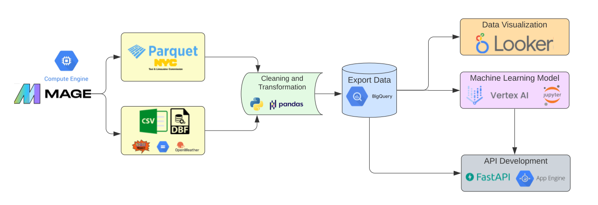
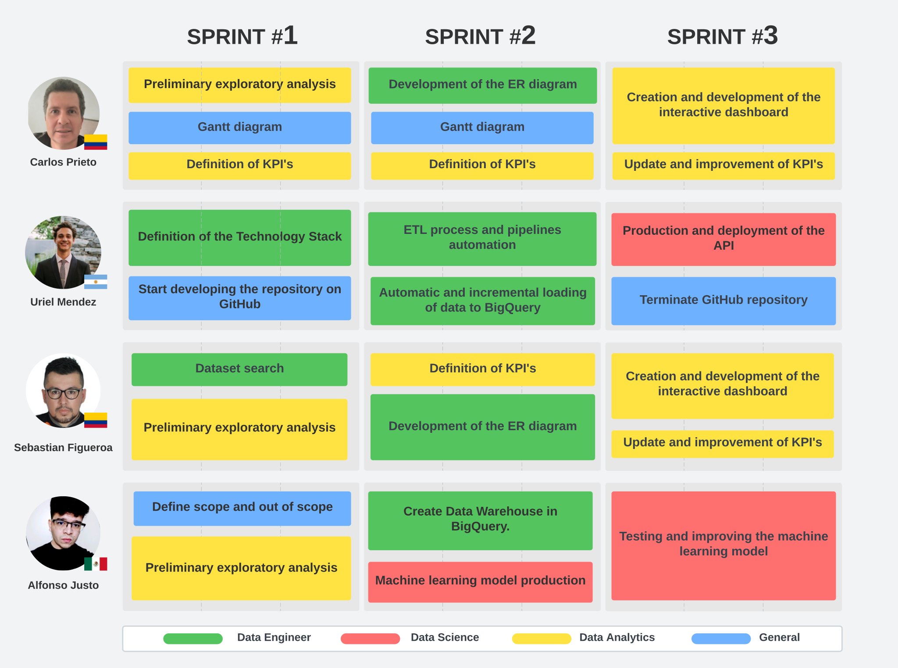

# Group project - NYC Taxis & Monoxide Carbon Emission Analysis
​

# Index
- [Introduction](#introduction)
- [Objectives](#objetives)
- [Technology Stack](#technology-stack)
- [ETL Process (Extract, Transform, Load)](#etl-process-extract-transform-load)
- [Gantt Diagram](#gantt-diagram)
- [Key Performance Indicators (KPIs)](#key-performance-indicators-kpis)
- [API](#api)
- [Data Source](#data-source)
- [Contributors](#contributors)


# Introduction
👋 Hi there! Welcome to our Data Science project, which is based on real and detailed historical datasets related to taxi services in Manhattan, New York. These datasets cover various transportation services, including the iconic yellow taxis, green taxis, for-hire vehicles, and high-volume for-hire vehicles, such as those provided by urban transportation companies like "Uber" or "Lyft," which operate in this city.

Furthermore, our project emphasizes a crucial aspect: the environmental impact of these transportation services on Manhattan. In a context where concerns about air quality and sustainability are growing, we are committed to analyzing how taxis contribute to carbon emissions in the city. Our goal is to offer possible solutions and opportunities in the electric vehicle market to taxi companies. This not only increases their profits but also contributes to environmental care.

# Objectives
1. 🚕 **Promote Electric Vehicle Adoption**: One of our main goals is to convince the project owner of the effectiveness of electric vehicles as a solution to reduce environmental pollution caused by transportation services using fossil fuels, such as taxis. We aim to present strong arguments supported by data and analysis that demonstrate the economic and environmental benefits of transitioning to electric vehicles.

2. 🧠 **Develop a Machine Learning Model for CO2 Prediction**: Another fundamental objective is to create a Machine Learning model capable of predicting the concentration of carbon dioxide (CO2) in the air of Manhattan for the upcoming months and years. This model will provide a better understanding of carbon emissions trends and assist in making informed decisions regarding environmental and transportation policies.

3. 📊 **Create an Interactive Travel Analysis Dashboard**: To provide a comprehensive view of mobility in Manhattan, we plan to develop an interactive dashboard displaying detailed analyses of taxi trips, as well as high-volume urban transportation companies like Uber and Lyft, in the city's 69 neighborhoods. This dashboard will enable the company to explore travel patterns, demand trends, and other relevant data, making data-driven decisions to enhance urban mobility and reduce environmental impact.


# Technology Stack
<div align="center">
  
</div>

# ETL Process (Extract, Transform, Load)
In the context of our data processing operations, we've implemented a rigorous ETL (Extract, Transform, Load) process using the advanced flow orchestrator, Mage.ai, the current replacement for Apache Airflow. This process has been carefully designed to tackle the inherent complexities of data related to various modes of transportation in New York City.

⛏️ **Data Extraction**

To obtain a reliable and comprehensive data source, we performed a web scraping process on the official website of the New York City Taxi and Limousine Commission. We used this technique to gather Parquet files containing historical data on trips conducted in various types of vehicles, including yellow taxis, green taxis, rental vehicles, and high-volume rental vehicles.

Additionally, we enhanced our dataset by incorporating historical information on carbon monoxide (CO) concentrations in Manhattan through the OpenWeather API. This comprehensive approach allowed us to enrich our understanding of environmental factors that may influence the city's mobility patterns.

🧹 **Data Transformation and Cleaning**

Each type of transportation subject to the ETL process underwent specific treatment to ensure data quality and consistency. This included identifying and handling missing values, as well as detecting and addressing outliers. Data transformation also involved standardizing and normalizing data structures, making it easier for subsequent analysis and visualization.

💽 **Loading into the Data Warehouse**

Once the data was clean, standardized, and enriched, we proceeded to export it to our Data Warehouse, specifically into BigQuery tables. This step is crucial for enabling advanced analytics and high-performance queries that drive our strategic decision-making processes.

<div align="center">
  
</div>

# Gantt Diagram
👉 *each sprint equals two weeks*
<div align="center">
  
</div> 


# Key Performance Indicators (KPIs)

# API

#### In order to provide up-to-date information about taxis and zones in the city of Manhattan, New York, we initiated the creation of an API. Through various endpoints, you can inquire about different topics.

Below, each endpoint is described along with the expected input and output information:

### *🎮 API Documentation:* **https://nyc-taxis-project.rj.r.appspot.com/docs**

<br>

- Path: ***`/`***

- Description: Root path. Option to query information about zones or taxis.

- Sample Request: https://nyc-taxis-project.rj.r.appspot.com

  ```json
  {
    "/zones": "Get info about zones",
    "/taxis": "Get info about taxis"
  }
  ```
<br>

<br>

- Path: ***`/zones`***

- Description: List of zones in the city of Manhattan

- Sample Request: https://nyc-taxis-project.rj.r.appspot.com/zones

  ```json
  {
    "Alphabet City": "4",
    "Battery Park": "12",
    "Battery Park City": "13",
    "Bloomingdale": "24",
    "Central Harlem": "41",
    "Central Harlem North": "42",
    "Central Park": "43",
    "Chinatown": "45",
    "Clinton East": "48",
    "Clinton West": "50",
    "East Chelsea": "68",
    "East Harlem North": "74",
    "East Harlem South": "75",
    ...
  }
  ```
<br>

<br>

  - Path: ***`/zones/{zone}`***

  - Description: Get the number of trips that occurred in the last month in a specific zone. Returns the number of trips for yellow taxis, green taxis, for-hire vehicles (grey taxis), and high-volume for-hire vehicles (black taxis).

  - Input Parameters: zone (str)

  - Sample Request: https://nyc-taxis-project.rj.r.appspot.com/zones/Bloomingdale

  ```json
  {
    "Zone": "Bloomingdale",
    "IdZone": 24,
    "year": 2023,
    "month": 5,
    "TotalTrips": 53496,  
    "TotalGreen": 1006,   
    "TotalYellow": 8376,  
    "TotalBlack": 43454,  
    "TotalGrey": 660,     
    "%_Green": 1.881,     
    "%_Yellow": 15.657,   
    "%_Black": 81.229,   
    "%_Grey": 1.234    
  }
  ```
<br>

<br>

- Path: ***`/taxis`***

- Description: Show the query options for the taxis

- Sample Request: https://nyc-taxis-project.rj.r.appspot.com/taxis

  ```json
  {
    "/greens": "Get a ranking of zones with the highest circulation of green taxis",
    "/yellows": "Get a ranking of zones with the highest circulation of yellow taxis",
    "/blacks": "Get a ranking of zones with the highest circulation of black taxis",
    "/greys": "Get a ranking of zones with the highest circulation of grey taxis"
  }
  ```
<br>

<br>

- Path: ***`/taxis/{color}`***

- Description: Returns a list of all zones sorted in descending order based on the number of trips in the last month.

- Input parameters: color (str) > (greens, yellows, blacks, greys)

- Sample Request: https://nyc-taxis-project.rj.r.appspot.com/taxis/yellows


  ```json
  [
    {
        "Ranking": 1,
        "Zone": "Upper East Side South",
        "IdZone": 237,
        "year": 2023,
        "month": 5,
        "TotalYellowTrips": 151348
    },
    {
        "Ranking": 2,
        "Zone": "Midtown Center",
        "IdZone": 161,
        "year": 2023,
        "month": 5,
        "TotalYellowTrips": 136388
    },
    {
        "Ranking": 3,
        "Zone": "Upper East Side North",
        "IdZone": 236,
        "year": 2023,
        "month": 5,
        "TotalYellowTrips": 134878
    },
    {
        "Ranking": 4,
        "Zone": "Lincoln Square East",
        "IdZone": 142,
        "year": 2023,
        "month": 5,
        "TotalYellowTrips": 109792
    },
    {
        "Ranking": 5,
        "Zone": "Midtown East",
        "IdZone": 162,
        "year": 2023,
        "month": 5,
        "TotalYellowTrips": 104264
    },
    ...
  ]
  ```

<br>

<br>

# Data Source
Our project relies on data from various sources to conduct comprehensive analysis. These data sources are essential for providing insights into different aspects of transportation and environmental impact in Manhattan, New York.

1. **NYC Taxi & Limousine Commission (TLC)**: We utilize historical and current data on trips from various types of public transportation services in the city of New York. This data source offers valuable information about taxi services, including yellow cabs, green cabs, and more. You can access the data at [NYC TLC Trip Record Data](https://www.nyc.gov/site/tlc/about/tlc-trip-record-data.page).


2. **Air Pollution Data from OpenWeather.org API**: We collect data on air quality based on the coordinates of Manhattan. This data source allows us to monitor air pollution levels and their impact on the city. For more information, visit [OpenWeather.org API - Air Pollution](https://openweathermap.org/api/air-pollution).


3. **Noise Project Data**: To understand noise pollution in Manhattan, we use data filtered for specific zones and neighborhoods. This data helps us assess the noise levels in different areas and their potential effects. You can access the data at [Noise Project Data](https://noiseproject.org/data-download/).


# Contributors

Sebastian Figueroa 

[](https://www.linkedin.com/in/ingesebasdatacoustics/)
[](https://github.com/SebasDatacoustic)

---
Carlos Prieto 

[](https://www.linkedin.com/in/carlos-prieto-1b140b269/)
[](https://github.com/cprieto76)

---
 Alfonso Justo 

[](https://www.linkedin.com/in/alfonso-justo-921785174/)
[](https://github.com/AJusto14)

---
 Uriel Mendez 

[](https://www.linkedin.com/in/uriellmendezz/)
[](https://github.com/uriellmendezz)


