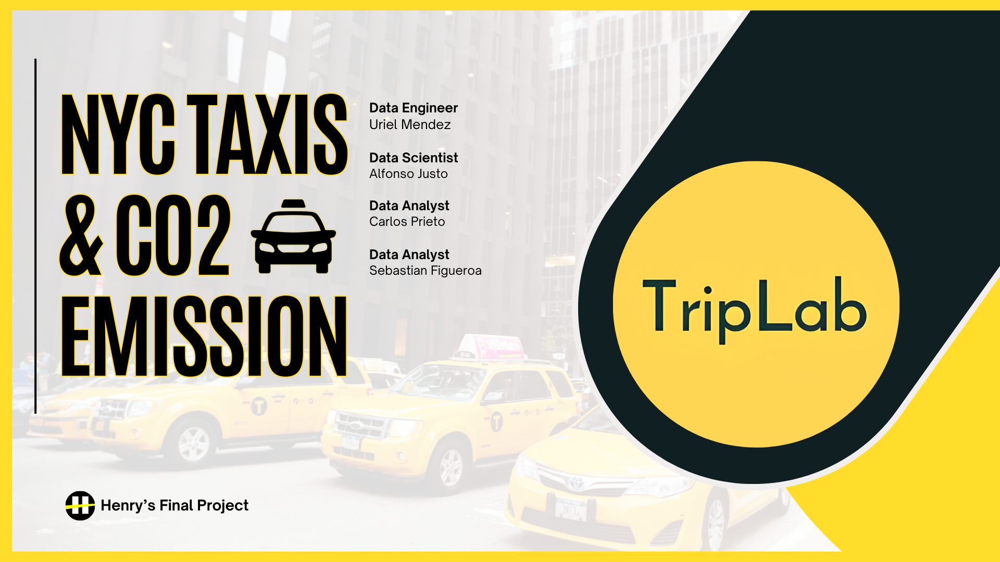
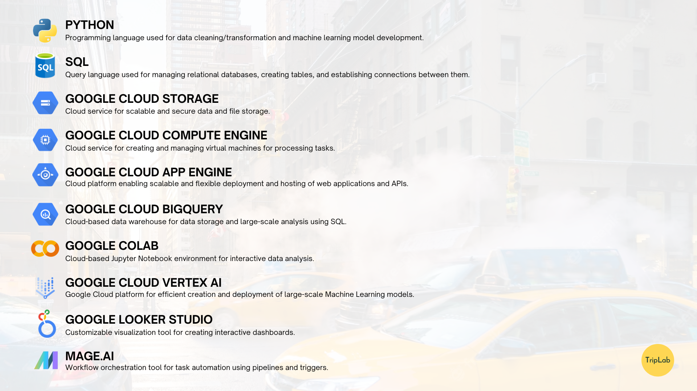

# Grupal project - NYC Taxis & Monoxide Carbon Emission Analysis
​

# Introducción
Te damos la bienvenida a nuestro proyecto de Data Science, el cual se fundamenta en conjuntos de datos históricos verídicos y detallados relativos a los servicios de taxi en Manhattan, Nueva York. Estos conjuntos de datos abarcan una variedad de servicios de transporte, desde los icónicos taxis amarillos y taxis verdes hasta los vehículos de alquiler y los vehículos de alquiler de alto volumen, como aquellos ofrecidos por empresas de transporte urbano como "Uber" o "Lyft", que operan en esta ciudad.

Además, nuestro proyecto pone especial énfasis en un aspecto de suma importancia: el impacto ambiental que estos servicios de transporte tienen en Manhattan. En un contexto en el que la preocupación por la calidad del aire y la sostenibilidad va en aumento, nos hemos comprometido a analizar la contribución de los taxis a las emisiones de carbono en la ciudad. Nuestra meta es proporcionar a las empresas de taxis posibles soluciones y oportunidades en el mercado de los vehículos eléctricos. De esta manera, no solo podrán aumentar sus ganancias y beneficios, sino que también contribuirán significativamente al cuidado del medio ambiente.

# Objectives
### Promover la Adopción de Vehículos Eléctricos
Uno de nuestros principales objetivos es persuadir a la propietaria del proyecto de la viabilidad de los vehículos eléctricos como una solución efectiva para reducir la contaminación ambiental causada por los servicios de transporte que utilizan combustibles fósiles, como los taxis. Buscamos presentar argumentos sólidos respaldados por datos y análisis que demuestren los beneficios económicos y ambientales de esta transición hacia vehículos eléctricos.
### Desarrollar un Modelo de Machine Learning para la Predicción de CO2
Otro objetivo fundamental es crear un modelo de Machine Learning capaz de predecir la concentración de dióxido de carbono (CO2) en el aire de la ciudad de Manhattan para los próximos meses y años. Este modelo permitirá una mejor comprensión de las tendencias de emisiones de carbono y ayudará en la toma de decisiones informadas sobre políticas ambientales y de transporte.

### Crear un Dashboard Interactivo de Análisis de Viajes
Para proporcionar una visión completa de la movilidad en Manhattan, tenemos la intención de desarrollar un dashboard interactivo que muestre análisis detallados de los viajes de taxis, así como de empresas de transporte urbano de alto volumen como Uber y Lyft, en los 69 barrios de la ciudad. Este dashboard permitirá a la empresa explorar patrones de viaje, tendencias de demanda y otros datos relevantes, lo que facilitará la toma de decisiones basadas en datos para mejorar la movilidad urbana y reducir el impacto ambiental.

# Technology Stack

  

### Python
Lenguaje de programación utilizado para la limpieza/transformación de los datos y desarrollo del modelo de machine learning.

### SQL (Structured Query Language)
Lenguaje de consultas utilizado para la gestión de bases de datos relacionales, la creación de tablas y la conexión entre las mismas.

### Google Cloud Storage
Servicio en la nube de almacenamiento escalable y seguro de datos y archivos.

### Google Cloud Compute Engine
Servicio en la nube para la creación y gestión de máquinas virtuales para tareas de procesamiento.

### Google Cloud App Engine
Plataforma en la nube que permite desplegar y alojar aplicaciones web y API's de manera escalable y flexible.

### Google Cloud BigQuery
Data Warehouse en la nube para el almacén de datos y análisis a gran escala con SQL.

### Google Colab
Entorno basado en Jupyter Notebook en la nube para análisis de datos interactivo.

### Google Vertex AI
Plataforma de Google Cloud para la creación y despliegue eficiente de modelos de Machine Learning a gran escala.

### Google Looker Studio
Herramienta de visualización personalizable para la creación de un dashboard interactivo.

### Mage.ai
Herramienta de orquestación de flujo de trabajo para la automatización de tareas mediante pipelines y triggers.

# Gantt Diagram
# Data quality
# Processes
# KPI’S
